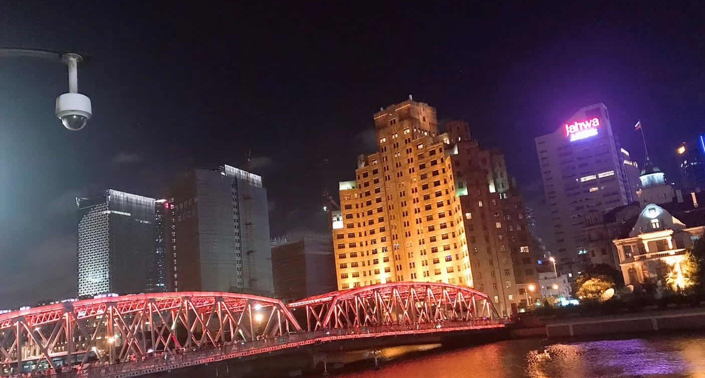
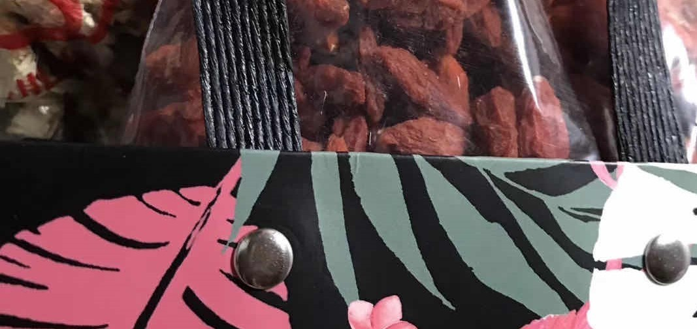

官宣后的第一次见面是在上海。那几天好热。白天几乎没找到什么好玩的地方。有一天下午在外面实在走不动了，回到宾馆躺在床上，你贴在我怀里睡着了。拉上窗帘后的房间暗暗的，只有窗户附近有金色的温柔的光透进来，那真是一个惬意的午后。

还有一天晚上我们去了一条很文艺的小巷子
 

>Love is patient, love is kind. It does not envy, it does not boast, it is not proud.  It does not dishonor others, it is not self-seeking, it is not easily angered, it keeps no record of wrongs.  Love does not delight in evil but rejoices with the truth.  It always protects, always trusts, always hopes, always perseveres.  Love never fails.    [Corinthians 13:4-8](https://www.biblegateway.com/passage/?search=1+Corinthians+13%3A4-8&version=NIV) 

晚上的外滩。没想到我一个在上海上学的，上大学之后第一次去外滩都已经大一结束了。不过外滩真的也就 just so so~ （虽然这么说后来还是去了好多次）
 

最后不要忘了宝贝还给我这个老年人带了枸杞和菊花。太关心我啦
 

